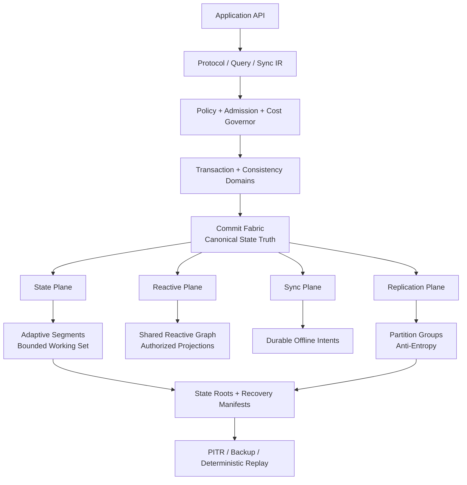

# Syncio Proof Path

Syncio treats technical claims as hypotheses until repeatable evidence supports them.

The repository's proof path is:

```text
problem
  -> architectural invariant
  -> implemented mechanism
  -> executable qualification
  -> measurement
  -> same-workload comparison
  -> evidence-backed claim
```

## Architectural invariant

Commit Fabric remains the canonical source of truth for externally visible state transitions. Realtime delivery, replication, offline synchronization, recovery, indexes, materializations, caches, and protocol adapters may accelerate or project state, but they cannot create a second authoritative history.

## Architecture map



## Mechanisms and evidence

| Claim area | Implemented mechanism | Qualification / evidence path | Comparative baseline |
| --- | --- | --- | --- |
| Canonical durability | Commit Fabric, fsynced WAL, recovery manifests, attested roots | qualification suite + fault injection + state digest verification | MongoDB / PostgreSQL / SQLite where semantics match |
| Bounded memory | SSD-authoritative state, bounded caches, WorkingSetGovernor | RSS and latency under fixed memory ceilings | MongoDB, SQLite/libSQL |
| Realtime efficiency | shared reactive execution graph, bounded materialization, resumable streams | commit-to-client p50/p95/p99, CPU/RAM per subscriber | Convex, Supabase Realtime, MongoDB change streams |
| Offline correctness | restart-durable semantic intents, preconditions, idempotency, deterministic conflicts | long-disconnect and reconnect-storm qualification | Couchbase Lite, Electric, Turso-class systems |
| Distributed correctness | consistency domains, partition groups, cross-partition transactions, repair | failover, partition, replica-loss and coordination benchmarks | CockroachDB, FoundationDB, TiKV |
| Hot-path efficiency | bounded cache and scheduler-aware foreground path | point read/write latency and cost under equivalent durability | Redis where semantics are comparable |
| Adaptive storage | workload-classified segment policy with hysteresis and safe fallback | read/write/space amplification and workload-regime change tests | MongoDB/WiredTiger, RocksDB-backed baselines |
| Operational progression | embedded -> server -> replicated -> partitioned -> multi-region topology contract | promotion/rollback qualification with unchanged logical API | representative embedded + managed alternatives |

## Evidence requirements

A comparative result is not accepted unless the evidence records:

- hardware;
- operating system and kernel;
- storage device;
- database versions;
- configuration;
- dataset;
- workload generator/specification;
- warmup;
- duration;
- raw measurements;
- failure behavior;
- reproducibility seed.

Run the repository evidence gate with:

```bash
npm run qualify:evidence -- <manifest.json>
```

Run the built-in production benchmark with:

```bash
npm run benchmark
```

Compare reports only when hardware and workload identity match:

```bash
npm run benchmark:compare -- syncio.json baseline.json
```

## Claim status doctrine

Implemented means the mechanism exists and is covered by repository qualification.

Qualified means the relevant invariant has passed the defined test/fault gate on a specific commit and environment.

Measured means raw benchmark data exists for the defined workload.

Comparatively proven means Syncio and a named alternative were measured under the same workload, hardware, durability semantics, and acceptance criteria.

No mechanism becomes comparatively proven merely because it exists.

## What would falsify a superiority claim?

A superiority claim must fail if a relevant baseline wins under the agreed workload or if Syncio's advantage disappears when durability, memory limits, failure behavior, or tail latency are normalized. The benchmark program is designed to find those failures, not hide them.
